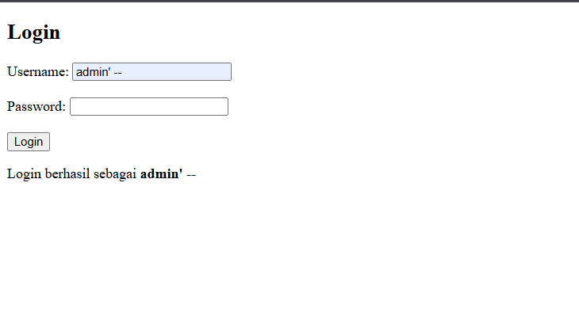
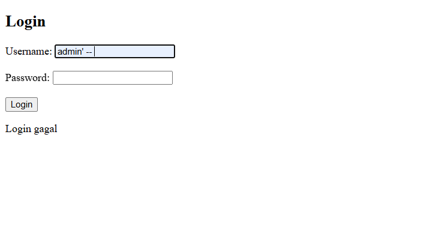

# Pengetesan SQL Injection sederhana

Pada file Login 

- belum ditambahkan pengaman prepared statement sehingga form login dapat diinject hanya dengan memasukas username admin' -- tanpa password
  

- sudah ditambahkan prepared. tidak dapat login hanya menggunkan username admin' -- 
  
